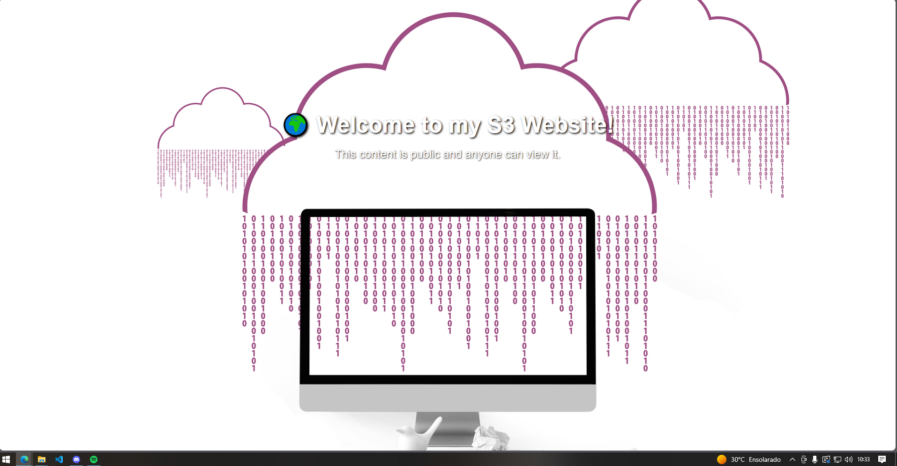
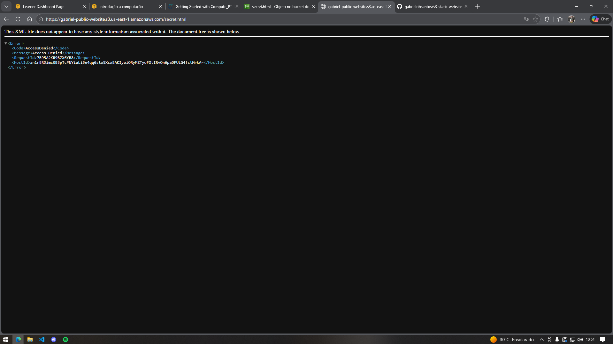

# S3 Static Website Demo

Static website demo hosted on **Amazon S3**, featuring a **public homepage** and a **private page** to simulate access control.

---

## 🚀 Project Overview
This project demonstrates how to:
- Host a static website on **AWS S3**.
- Configure **public content** (`index.html`) accessible to everyone.
- Configure **private content** (`secret.html`) restricted to authorized IAM users.
- Apply **bucket policies** to separate public and private access.

---

## 📂 Repository Structure

s3-static-website-demo/
├── index.html         # Public homepage
├── secret.html        # Private page (restricted access)
├── cloud.png          # Background image for public page
├── lock.jpg           # Background image for private page
├── style.css          # Stylesheet 
└── screenshots/
      ├── public.png
      └── private.png

---

## ⚙️ How It Works
1. **Public page (`index.html`)**  
   - Accessible to anyone via the S3 static website endpoint.  
   - Shows a cloud-themed background with a welcome message.  

2. **Private page (`secret.html`)**  
   - Not publicly accessible.  
   - Requires IAM credentials to retrieve via AWS CLI or SDK.  
   - Displays a lock-themed background with restricted access message.  

---

## 🔒 Access Control Simulation
- **Bucket Policy** allows public read access only to `index.html` and assets (images).  
- **IAM Policy** grants access to `secret.html` for authorized users.  
- Demonstrates how to separate **public vs private content** in cloud storage.

---

## 🖥️ Deployment Options
- **Amazon S3** → Full access control simulation.  
- **GitHub Pages** → Public demo (note: private page cannot be restricted here).  

---

## 📸 Screenshots

### Public Page

### Private Page

### Access Denied Page

---

## 🎯 Learning Outcomes
- Understand AWS S3 static website hosting.  
- Learn how to configure bucket policies.  
- Practice IAM permissions for restricted content.  
- Showcase DevOps/cloud skills in a practical project.

---

## 📌 Author
👤 **Gabriel Ribeiro dos Santos**  
Cloud & DevOps Journey 🚀  

